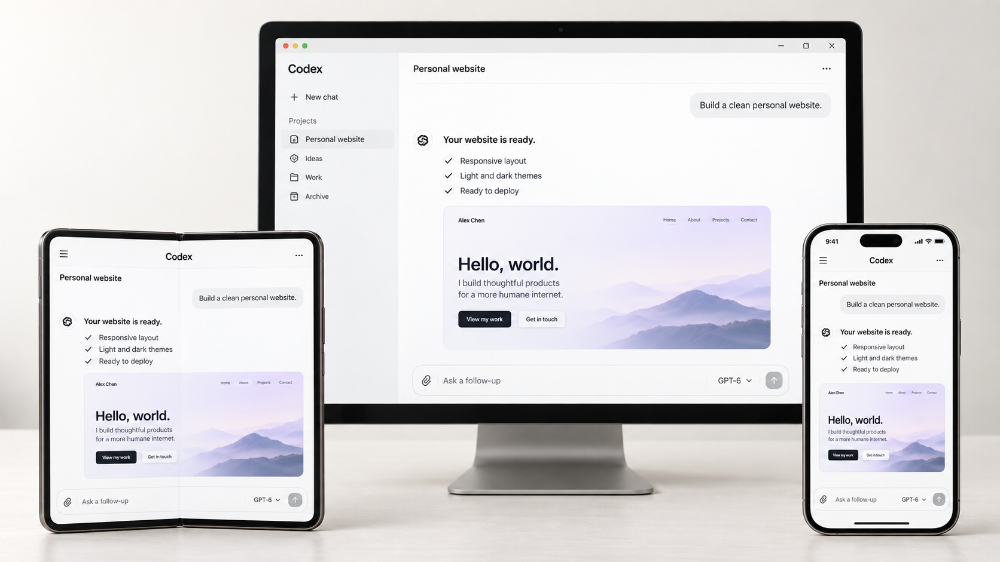

# Open Remote Harness Desk

[English](README.md) | [简体中文](README.zh-CN.md)

Open Remote Harness Desk is a self-hosted AI coding workspace for three harnesses: **Codex, Claude Code, and ZCode**. It syncs Codex desktop conversation state to the Web so you can continue the same work in a browser. This project provides the web interfaces, conversation sync, file and terminal access, attachments, and service integration; locally installed tools still perform the model work.

The current entry points are Codex at `/`, Claude Code at `/claude/app/`, and ZCode at `/zcode`. More harness integrations are planned.



> **Author's note:** This project was built with GPT-6 in one afternoon. The author has not read a single line of its code and makes no guarantees about its quality or security.

## Why this exists

Official Remote is slow in our use case and does not offer a convenient way to keep using desktop conversations and features when we step away from the computer. Finding the project again and restating the context in a browser interrupts the work.

The goal is simple: **open the Web workspace anywhere and pick up where you left off.** Continue conversations, check progress, handle approvals, and access project files and a terminal without shifting your attention to a new environment.

We recommend publishing the Web entry point with HTTPS and login authentication. Then you can open a browser wherever you are and keep the vibe coding going.

## Features

- **Codex desktop state sync:** See the same task's messages, reasoning and tool progress, run state, and permission settings on the Web. Follow-up messages and approval decisions made in the browser return to the original conversation, so there is no need to recreate its context.
- **Claude Code in the browser:** The Claude service uses the Claude Agent SDK to invoke the local `claude` CLI, while the Web UI provides a desktop-like experience for conversations, projects, tool calls, approvals, and attachments. You can select the CLI with `CLAUDE_CLI_PATH`; on Windows, the SDK may use its bundled executable if it cannot resolve the local CLI.
- **Continue existing conversations:** Open and continue local Codex and Claude Code conversations, browse their history, and organize them by project. ZCode connects to the locally installed application through the same entry point.
- **Handle approvals on the Web:** Approve or reject Codex command execution, file changes, and permission requests; answer multiple-choice or free-text questions. The Claude Web interface also handles tool permissions and questions.
- **Inspect and work with the workspace:** The Codex Web interface includes project file browsing and previews, attachments, a terminal, code-change review, and a browser panel. You do not have to judge progress from chat messages alone.
- **Choose how each conversation runs:** Select a model, reasoning level, and permission mode; upload images or files; and inspect tool calls and reasoning summaries. The Claude Web interface can also create its own scheduled tasks with a selected model and permission mode.
- **Pick up work in a browser:** Reopen the original conversation, read its progress, and send follow-ups. Drafts and other UI state remain in the browser where you wrote them. Switch among Codex, Claude Code, and ZCode from the same Web entry point.
- **Move a project conversation between Codex and Claude Code:** Import a conversation in either direction within the same project, see the import progress, and continue in the new conversation on the destination side. This requires the session converter.

## Repository layout

```text
server/
  gateway/       Shared HTTP/WebSocket entry point, auth, web proxy, files, terminal
  codex/         Codex desktop bridge, history, queue, projects, code review
  claude/        Claude Code service: conversations, projects, attachments, permissions, tasks
  zcode/         Relay and web adapter for the locally installed ZCode
web/
  codex/         Codex Web UI, shared product switcher, system theme script
  claude/        Claude Web UI (React + Vite)
  shared/        Conversation import UI shared by the two interfaces
android/         Android WebView client source, assets, build scripts
scripts/         Development, startup, systemd installation, LAN discovery
deploy/          systemd deployment templates
tests/           Gateway, Web UI, and cross-interface checks
```

The ZCode page comes from the locally installed ZCode application. This repository contains only its integration code, not the application package.

The gateway and the individual services are **separate in the source tree**. The gateway process still hosts the Codex bridge and ZCode relay, while the Claude service runs separately; splitting the directories did not add extra service processes.

## Install and build

We recommend asking your AI assistant to build and deploy the project; the author does not know how their own AI built it either. The existing repository commands are listed below for your assistant to inspect and use.

You need Node.js 22, npm, Bun, Git, and locally installed and authenticated Codex, Claude Code, and ZCode. The Linux terminal uses `node-pty`, so a local C/C++ toolchain may be needed during installation. Image previews use Python 3 and Pillow.

```bash
npm run install:deps       # Install locked dependencies for the root, Claude service, and Claude Web UI
npm run build              # Build the gateway and Codex Web UI
npm run build:claude       # Build the Claude Web UI for /claude/app/
npm run build:server:claude
npm run install:converter  # Install transession 0.2.0 for conversation import; requires Rust/Cargo
```

Each component has its own `package-lock.json`. Running with Bun does not require a second package-manager lockfile. Generated files are excluded from Git.

Codex and Claude Code support two-way conversation import within the same project. Start a new conversation in the project and select a source conversation from the other interface. The four stages are reading, conversion, writing, and verification; other conversations remain usable during import. Install the converter with `npm run install:converter`.

## Run

Development gateway:

```bash
XARNESS_BUNDLED_CODEX_BIN=/absolute/path/to/codex npm run dev
```

By default, it listens on `127.0.0.1:8899`. The Codex executable path must be absolute; see [.env.example](.env.example) for the available options. To develop Claude separately, use `npm run start:claude`; for its Web UI, use `npm --prefix web/claude run dev` (proxied to local port 3001). Check that existing services are not using those ports before starting components separately.

For a persistent local installation, use the existing systemd services:

```bash
npm run services:install   # Install/update templates and start the shared target; does not restart running services
npm start
npm run status
./start.sh logs
```

`deploy/` and `scripts/start-gateway.sh` are deployment templates. Adjust program paths, listen addresses, and any optional tunnel configuration for another machine. `npm run restart` restarts the whole workspace and interrupts active service connections; routine frontend updates do not require it.

See [android/README.md](android/README.md) for the Android build.

## Checks

```bash
npm run check
npm test
npm --prefix server/claude run typecheck
node --test tests/unified-start.test.mjs tests/claude-conversation-state.test.mjs tests/claude-workspace.test.mjs
```

`tests/` also contains browser, protocol, and integration checks. Run checks that require actual model execution or a locally installed application separately; simulated tests are not proof of real model behavior. Local `docs/` files are not included in Git.

## Data and attribution

Conversations, login credentials, databases, uploaded attachments, and installation packages are excluded from Git. Codex, Claude, and ZCode keep their existing local data directories; Claude data remains in `~/.cloudcli/`, and the service environment file is `server/claude/.env`. Android signing keys stay on the local machine.

This project integrates and maintains parts of existing open-source projects; it does not contain their complete upstream products. The repository keeps the code used here and omits unused CloudCLI pages, Electron code, publishing tools, plugin templates, and a demo backend. Its initial commit contains the trimmed version, without the discarded files or their earlier Git history; upstream attribution and license notices were retained.

See [THIRD_PARTY_NOTICES.md](THIRD_PARTY_NOTICES.md) for upstream sources and component licenses. The root [LICENSE](LICENSE) retains the upstream Codex WebUI MIT notice; the Claude service retains its own AGPL license and NOTICE. The entire repository should not be treated as MIT-licensed.
